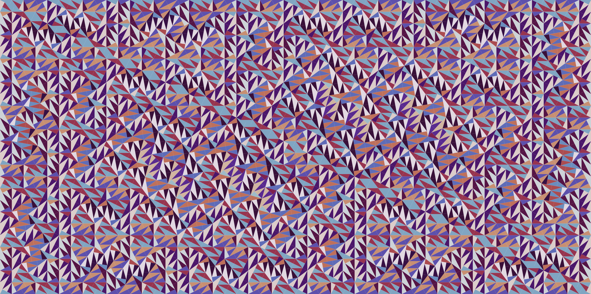
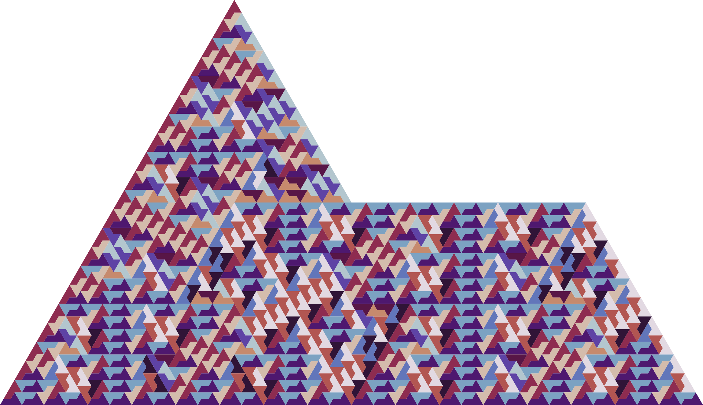

# Py-Rep-Tile

A simple python program that allows a user to construct various simple
[rep-tile](https://en.wikipedia.org/wiki/Rep-tile)
tilings. Current implementations include

- [pinwheel](https://en.wikipedia.org/wiki/Pinwheel_tiling)
- [sphinx](https://en.wikipedia.org/wiki/Sphinx_tiling)

For additional prettiness rep-tiles are coloured by orientiation.

# Example Results




# Usage

Some examples are provided in a `Makefile`

```
> make
help         Display this message.
pinwheel     Generate a pinwheel tiling.
sphinx       Generate a sphinx tiling.
test         Run testing suite.
clean        Standardize repository.
deps         Install dependencies.
```

Additional interfacing details are available through `main.py` via the `-h` flag.

```
> python main.py -h
usage: main.py [-h] rep_tile iterations

Pinwheel tiling program.

positional arguments:
  rep_tile    Type of rep-tile to iteratively generate. Select from
              ('pinwheel', 'sphinx')
  iterations  Number of times to iteratively subdivide rep-tiles into.

optional arguments:
  -h, --help  show this help message and exitusage: main.py [-h] [--rectangle AS_RECTANGLE] depth
```
