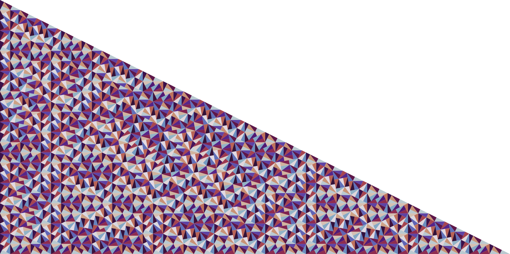

# PynWheel



A simple Conway [pinwheel tiling](https://en.wikipedia.org/wiki/Pinwheel_tiling) generator written
in Python. For additional prettiness the triangles are coloured in by the phase of each triangle's 
short leg.

# Usage

Some examples are provided in a `Makefile`

```
> make
help         Display this message.
run          Generate a pinwheel tiling.
rect         Generate a pinwheel tiling as a rectangular mural.
profile      Profile Code.
test         Run testing suite.
clean        Standardize repository.
deps         Install dependencies.
```

Additional interfacing details are available through `main.py` via the `-h` flag.

```
> python main.py -h
usage: main.py [-h] [--rectangle AS_RECTANGLE] depth

Pinwheel tiling program.

positional arguments:
  depth                 Depth of copies to form fractal

optional arguments:
  -h, --help            show this help message and exit
  --rectangle AS_RECTANGLE
                        Print final image as rectangle y/[n]
```
